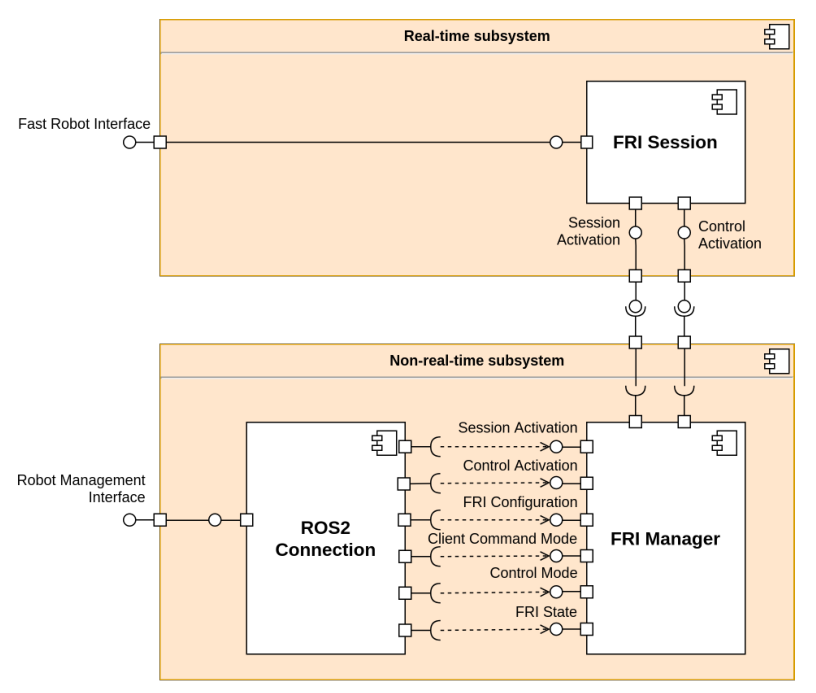
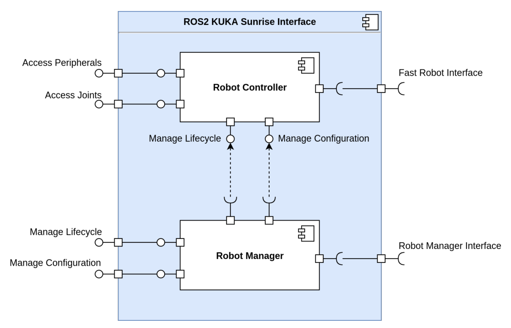
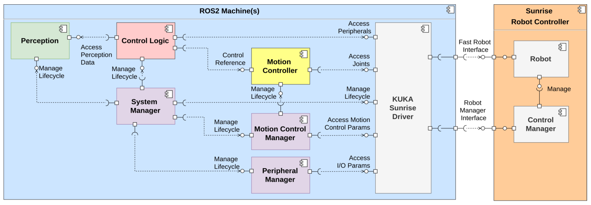
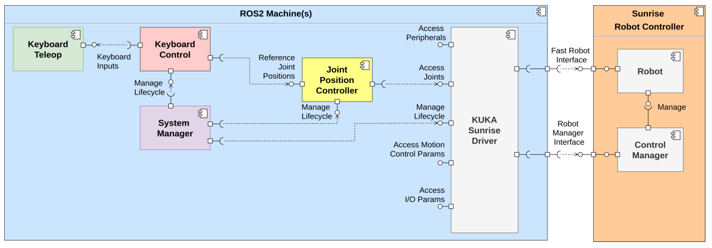
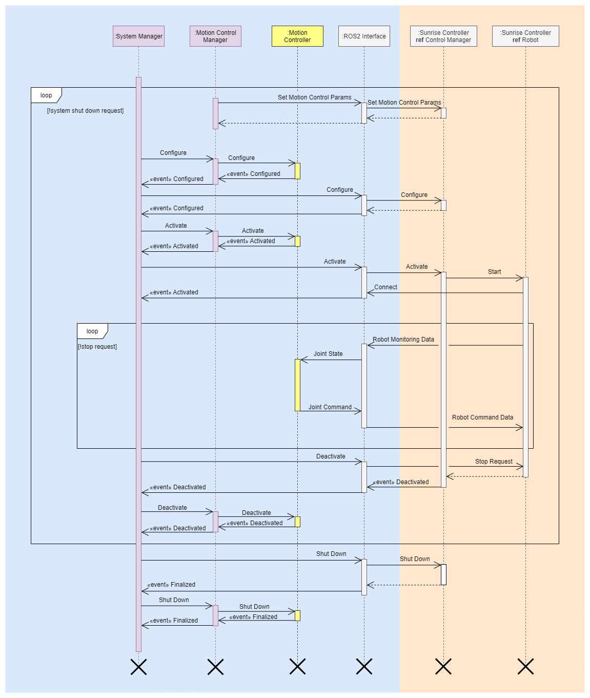

# Design

## Use case analysis

This project aims at creating a comprehensive driver that could be a reliable part of various ROS2 applications. To guide the architectural decisions, we conducted a simple use case analysis:

We identified the following use cases:

- **Robot State**
  The current state of the robot should be accessible to ROS2. This includes the measured joint positions and torques, field bus inputs, FRI state and motion tracking performance.
- **Robot Command**
  Commands from ROS2 for controlling the motion and field bus outputs should be passed to the robot.
- **Configure**
  The ROS2 system should be able to access and change various configuration parameters of the FRI Session (robot monitoring) and the FRI controlled motion (robot commanding).
- **Manage lifecycle**
  The driver should implement the ROS2 lifecycle node interface.
- **Handle error**
  Various errors that arise on the robot should be handled by the driver if possible. Some errors may change the lifecycle state and require external handling from ROS2.

To accomplish these, two connection points are needed towards the robot. Configuration, lifecycle management and error management has to be done before or after a real-time control session. The robot application running on the robot should provide interfaces for these use cases and manage the FRI Session and motion control according to the given configuration. Once an FRI Session is started by the robot application, the robot state can be accessed and commands can be sent on the FRI in a real-time manner. On the diagram on Figure 3.2, the Robot Application has been referred to as *Robot Manager* and the FRI Session as *Robot* in order to better reflect their roles in the system.

The presented ROS2 actors show an example on how these use cases can be handled by the user. The Robot State can be used by various *Robot State Listeners* for visualization and control purposes. Robot Commands can be given by control nodes. For handling the lifecycle and the configuration, a *System Manager* and *Configuration Manager* could be used, respectively. However, this is only an example scenario, the power of ROS2 is that such a robot driver can be integrated in the system according to the user's needs.

## The ROS2_Control Sunrise project

(Note: not to be confused with ros-controls/ros2\_control!)

The driver can control the robot only if the necessary program is running on it. Because of this, we developed a Robot Application to enable reconfiguration and motion control of the robot through ROS2. We named the Sunrise Project that contains the Robot Application and all developed Java files *ROS2_Control*. The following figure illustrates the components running on the robot controller during ROS2 control: 

The ROS2 KUKA Sunrise Driver connects to the real-time Fast Robot Interface and the non-real-time Robot Manager Interface. The *FRI Session* component is provided by the Sunrise.FRI option package. The non-real-time components *ROS2 Connection* and *FRI Manager* have been developed as part of this project. 

## The kuka_sunrise ROS2 package

This package contains the client side of the implementation of the ROS2 KUKA Sunrise Driver using the C++ ROS2 API (rclcpp) and the FRI C++ client libraries, targeting the Linux operating system. To ensure real-time performance, the preempt_rt patch has to be installed on the system that runs ROS2.

### Internal modules of the driver

Realized as ROS2 nodes.

- **Robot Controller**
  The Robot Controller with the robot through the Fast Robot Interface. On the ROS2 side, the joint states and field bus inputs are made available using publishers. The joint commands and field bus output commands are listened to on another set of topics. When activated, the Robot Controller is part of the real-time control loop.

- **Robot Manager**
  The Robot Manager is a management and configuration module for the ROS2 KUKA Sunrise Driver. It interacts with the Robot Application on the Robot Manager Interface and also manages the Robot Controller module.

### Interfaces of the driver

#### Towards the robot

- **Fast Robot Interface**
  Real-time communication UDP interface for enabling external joint-level control of the robot. Completely realized by the FRI client library.

- **Robot Manager Interface**
  Non-real-time TCP interface to the Robot Application running on the Sunrise Cabinet to manage the lifecycle of the robot and to configure the control parameters.

#### Towards ROS2

- **Access Peripherals**  (TODO)
  The driver publishes the configured field bus inputs to individual ROS2 topics in each real-time loop and subscribes to individual topics for the configured field bus outputs. 

- **Access Joints**
  The driver publishes the joint states on a ROS2 topic in each real-time loop and listens for the joint commands on another topic.

- **Manage Lifecycle**
  The state of the driver can be managed via the ROS2 lifecycle and other custom services.

- **Manage Configuration**
  Parameters of the driver can be set via the ROS2 parameter services. Changes are either handled in callbacks if needed, or they are used upon lifecycle state transitions.

# General application architecture

A module diagram of a general application as we envision it:

# Example application

The module diagram of an example application that we created:

In this example application the individual joints of the LBR iiwa can be controlled via keyboard inputs. Refer to the [1. Quick start guide](1.-Quick-start-guide.md) for more information on how to setup the application.

The typical lifecycle of the motion control is shown by the following sequence diagram:

