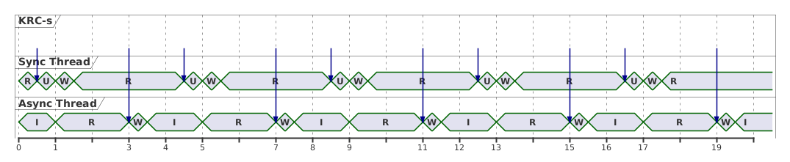
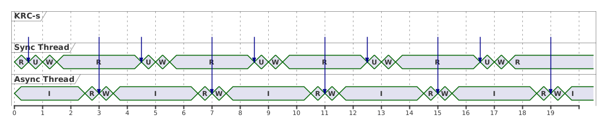
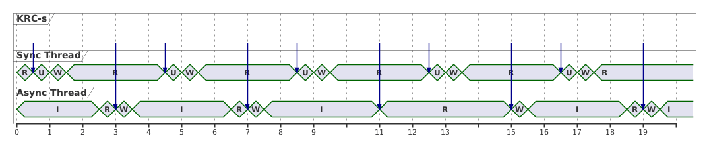
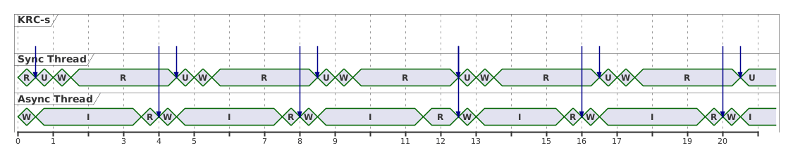

# Welcome to the ROS2 KUKA drivers project

## Goals of the project

This project aims to provide reliable real-time capable drivers for all KUKA robots. Currently KUKA robots are available with 3 different operating systems with real-time control API-s:

- KSS supporting industrial robots, with Robot Sensor Interface (RSI)
- Sunrise supporting cobots (LBR iiwa-s), with Fast Robot Interface (FRI)
- iiQKA supporting cobots (LBR iisy-s), with ExternalAPI.Control (EAC)
- iiQKA.OS2 supporting industrial robots, with Robot Sensor Interface (RSI >= 6.0.0)

It is also the goal of this project to provide the same API for all four OS-s, hiding the underlying startup procedure and communication technology, thus enabling changing seamlessly to a different KUKA OS.

Additionally the aim was to write high quality, maintainable code with standardized interfaces, that conforms with the standards defined by the [ROS-Industrial project](https://www.rosin-project.eu/).

## Common interface

Two different interfaces should be defined for all drivers supporting real-time control:

- real-time interface, defining how to handle the cyclic dataflow
- non-real-time interface, defining the startup procedure with optional configuration

### Real-time interface

The choice for the real-time interface was straightforward, as a standardized control framework exists for ROS2, called `ros2_control`, also supported by ROS-Industrial. The drivers are built using this framework, therefore it is recommended the read through its [documentation](https://control.ros.org/master/doc/ros2_control/doc/index.html), as this documentation builds on the knowledge of the framework.

All 3 of the KUKA real-time interfaces handle the timing on the controller side, so external control is always synchronized with the internal control cycle. This means, that calling the `read` method of the `controller_manager` cannot return immediately, but has to wait until the controller sends an update, which is triggered by the internal clock. Because of this blocking read, the default `ros2_control_node` cannot be used, as there it is expected that the `controller_manager` handles the timing according to the configured control frequency. Therefore a [custom control node](https://github.com/kroshu/kuka_drivers/blob/master/kuka_drivers_core/src/control_node.cpp) was implemented that uses the `controller_manager` and all other tools of `ros2_control`, but leaves the time management to the robot controller.

This change does not influence the API of the `ros2_control` framework, the real-time dataflow can be accessed by any controller.

### Non-real-time interface

The startup procedure for any system in ROS can be defined using a launch file, that can start multiple processes. By default, starting the control node with a hardware interface and controllers configured immediately starts external control. This behaviour has a few drawbacks:

- The user cannot configure some parameters during runtime, that cannot be changed during external control
- The user cannot easily synchronize the start of external control with other components of the system
- It can cause unexpected behaviour, which can be potentially dangerous to the hardware or surroundings.
  - In torque control mode, the robot can start to move, if the torque sensors are not perfectly calibrated (and as that is hard to achieve, this can happen in most cases). This could be mitigated with a simple torque controller that tries to hold the position, but there is no guarantee that loading and activating the controller was successful, external control would start even if it failed. This could result in a scenario, where the robot starts to move unexpectedly.

The last issue should be certainly prevented from happening, therefore it was decided to extend the default startup procedure with a [lifecycle interface](https://design.ros2.org/articles/node_lifecycle.html), that synchronizes all components of the driver. The hardware interfaces and controllers already have a lifecycle interface, but by default they are loaded and activated at startup. This configuration was modified to only load the hardware interfaces and controllers, configuration and activation is handled by a custom a lifecycle node, called `robot_manager`. The 3 states of the `robot_manager` node have the following meaning:

- `unconfigured`: all necessary components are started, but no connection is needed to the robot
- `configured`: The driver has valid parameters configured, external control can be initiated. It is possible to change most parameters (with the exception of IP addresses and robot model) in this state without having to clean up the `robot_manager` node. Connection to the robot might be needed. (All of the parameters have default values in the driver, which are set on the robot controller during configuration.) A few [configuration controllers](https://github.com/kroshu/kuka_drivers/wiki/4_Controllers#3-configuration-controllers) might be active, that handle the runtime parameters of the hardware interface.
- `active`: external control is running with cyclic real-time communication, controllers are active

To achieve these synchronized states, the state transitions of the system do the following steps (implemented by the launch file and the `robot_manager` node):

- startup: all components of the system are started: `control_node`, `robot_manager` node, `robot_state_publisher` (optionally `rviz`) and all of the necessary controllers are loaded and configured
- `configure`: activate configuration controllers, configure hardware interface
- `activate`: activate real-time controllers, activate hardware interface
- `deactivate`: deactivate hardware interface, deactivate real-time controllers
- `cleanup`: clean up hardware interface, deactivate configuration controllers

Note: the lifecycle interface of the controllers are a little bit different, as they do not have a `cleanup` transition. To have a consequent `unconfigured` state, the configuration of the controllers are not handled in the `configure` transition, but at startup.

Including the controller state handling in the system state makes the implementation more complex, as controllers must be deactivated and activated at control mode changes, but it has two advantages:

- minor performance increase: unused controllers are not active and therefore do not consume resources
- unexpected behaviour is not possible: external control will not start on the robot, unless all necessary controllers are successfully activated, while control mode changes (on the robot) are only possible after the controllers for the new control mode are activated.

The consequence of the lifecycle interface is, that 3 commands are necessary to start external control for all robots:

- start the appropriate launch file for your robot with your robot model as parameter (details can be found [here](#detailed-setup-and-startup-instructions))
- `ros2 lifecycle set robot_manager configure`
- `ros2 lifecycle set robot_manager activate`

### Control mode definitions

The control mode specifications are also part of the common API. They are defined as an enum in the [`kuka_drivers_core`](https://github.com/kroshu/kuka_drivers/blob/master/kuka_drivers_core/include/kuka_drivers_core/control_mode.hpp) package, and have the following meaning:

- joint position control: the driver streams cyclic position updates for every joint.
  - Needed command interface(s): `position`
- joint impedance control: the driver streams cyclic position updates for every joint and additionally stiffness [Nm/rad] and normalized damping [-] attributes, which define how the joint reacts to external effects (around the setpoint position). The effect of gravity is compensated internally. (FRI does not allow changing the impedance attributes in runtime, therefore the initial damping and stiffness values are valid for the whole motion.)
  - Needed command interface(s): `position`, `stiffness`, `damping`
- joint velocity control: the driver streams cyclic velocity updates for every joint.
  - Needed command interface(s): `velocity`
- joint torque control: the driver streams cyclic torque updates for every joint, which define the torque overlay to be superimposed over gravity compensation. (An input of 0 means, that the joint should remain in gravity compensation and should not move.)
  - Needed command interface(s): `effort`
- cartesian position control: the driver streams cyclic pose updates for every degree of freedom. The orientation representation is the KUKA ABC convention. It is the responsibility of the user to stream poses, for which a valid IK solution exists.
  - Needed command interface(s): `cart_position`
- cartesian impedance control: the driver streams cyclic pose updates for every degree of freedom. Additional stiffness [N/m or Nm/rad] and normalized damping [-] attributes define the behaviour of each degree of freedom to external forces. The nullspace stiffness and damping values define the behaviour of the redundant degree(s) of freedom.
  - Needed command interface(s): `cart_position`, `cart_stiffness`, `cart_damping`, (`nullspace_stiffness`, `nullspace_damping`)
- cartesian velocity control: the driver streams cyclic cartesian velocity (twist) updates for every degree of freedom. It is the responsibility of the user to stream velocities, for which a valid IK solution exists.
  - Needed command interface(s): `cart_velocity`
- wrench control: the driver streams cyclic wrench updates, which define the forces and torques, that the robot end effector should exert on the environment. The effect of gravity is internally compensated. (If the environment does not have a counterforce, the robot will start to move)
  - Needed command interface(s): `wrench`

### Supported features

The following table shows the supported features and control modes of each driver. (`✓` means supported, `✗` means not supported by the KUKA interface, empty means supported by the KUKA interface, but not yet supported by the driver)

|OS | Joint position control | Joint impedance control | Joint velocity control | Joint torque control | Cartesian position control | Cartesian impedance control | Cartesian velocity control | Wrench control| I/O control|
|---|:---:|:---:|:---:|:---:|:---:|:---:|:---:|:---:|:---:|
|KSS| ✓ | ✗ | ✗ | ✗ | | ✗ | ✗ | ✗ | ✓ |
|Sunrise| ✓ | ✓ | ✗ | ✓ | | | ✗ | | |
|iiQKA| ✓ | ✓ | ✗ | ✓ | ✗ | ✗ | ✗ | ✗ | ✗ |
|iiQKA.OS2| ✓ | | | | | | | | ✓ |

## Additional packages

The repository contains a few other packages aside from the 3 drivers:

- `kuka_driver_interfaces`: this package contains the custom message definition necessary for KUKA robots.
- `kuka_drivers_core`: this package contains core functionalities used by more drivers, including the `control_node`, base classes for nodes with improved parameter handling, enum and constant definitions and a class for managing the controller activation and deactivation at control mode changes. Details about these features can be found in the package [documentation](https://github.com/kroshu/kuka_drivers/blob/master/kuka_drivers_core/README.md)
- `kuka_rsi_simulator`: this package contains a simple simulator of RSI, that implements a UDP server accepting the same xml format as RSI and returning the commanded values as the current state, without any checks.

## MoveIt integration

The `ros2_control` framework supports MoveIt out-of-the-box, as the `joint_trajectory_controller` can interpolate the trajectories planned by it. Setting up Moveit is a little more complex, therefore an example package, `iiqka_moveit_example`, is provided to help developers. The `iiqka_moveit_example` package is located in the [`examples`](https://github.com/kroshu/examples) repository. This contains basic examples of using MoveIt with the driver. Additionally, it contains a [launch file](https://github.com/kroshu/examples/blob/master/iiqka_moveit_example/launch/launch_trajectory_publisher.launch.py) that commands 4 goal positions near the home position cyclically (the points and parameters can be modified in [this](https://github.com/kroshu/examples/blob/master/iiqka_moveit_example/config/dummy_publisher.yaml) configuration file). This can be used to test moving any robot with the driver, and is the recommended way instead of the `rqt_joint_trajectory_controller`, which commands very jerky trajectories due to batching.

As mentioned earlier, the package contains a [launch file](https://github.com/kroshu/examples/blob/master/iiqka_moveit_example/launch/moveit_planning_example.launch.py) that starts the iiQKA driver, `rviz`, and the `move_group` server with the required configuration. The `robot_manager` lifecycle node should be configured and activated after startup.

After activation, the Motion Planning plugin can be added (`Add` -> `moveit_ros_visualisation` -> `MotionPlanning`) to plan trajectories from the `rviz` GUI. (`Planning group` in the `Planning` tab should be changed to `manipulator`.)

The package also contains examples of sending planning requests from C++ code, in which case the `rviz` plugin is not necessary. The `MoveitExample` class implements a wrapper around the `MoveGroupInterface`, the example executables in the package use this class to interact with `Moveit`. Four examples are provided:

- `moveit_basic_planners_example`: the example uses the `PILZ` motion planner to plan a `PTP` and a `LIN` trajectory. It also demonstrates that planning with collision avoidance is not possible with the `PILZ` planner by adding a collision box that invalidates the planned trajectory.
- `moveit_collision_avoidance_example`: the example adds a collision box to the scene and demonstrates, that path planning with collision avoidance is possible using the `OMPL` planning pipeline.
- `moveit_constrained_planning_example`: this example demonstrates constrained planning capabilities, as the planner can find a valid path around the obstacle with the end effector orientation remaining constant (with small tolerance).
- `moveit_depalletizing_example`: this example shows a depalletizing example: a 3x3x3 pallet pattern is added to the scene, the robot can successfully finish the depalletizing process by attaching each pallet to the end effector and moving it to a dropoff position with collision avoidance.

Note: the first three examples should be executed consequently (without restarting the launch file) to ensure that the collision objects are indeed in the way of the trivial path. The 4. example should be executed independently, so that the collision box added in the other examples are not there (launch file should be restarted after the other examples).

Note: The examples need user interaction in `rviz`, the `Next` button (`RvizVisualToolsGui` tab) should be pressed each time the logs indicate it.

### Planning in impedance mode

Planning with `Moveit`, or simply moving the robot in impedance mode is quite tricky, as often there is a mismatch between the actual and commanded positions.
Both `Moveit` and the `joint_trajectory_controller` start planning/execution from the actually measured values, creating a jump in the commands (from the previous command to the measured state), which can trigger a joint limit violation. To solve this issue, the planning request must be modified to start from the commanded position instead of the measured one.
For example in the `moveit_basic_planners_example` the following lines must be added before each planning request:

```C++
  moveit_msgs::msg::RobotState start_state;
  std::vector<double> commanded_pos;  // TODO: fill this vector with the actually commanded positions
  start_state.joint_state.name = example_node->moveGroupInterface()->getJointNames();
  start_state.joint_state.position = commanded_pos;
  example_node->moveGroupInterface()->setStartState(start_state);
```

The joint position values commanded are available on the topic `/joint_group_impedance_controller/commanded_positions`.

Additionally the `trajectory_execution.allowed_start_tolerfance` parameter in `moveit_controllers.yaml` (found in the moveit support packages) should be increased based on the actual displacement between commanded and measured joint values.

If you would like to only move the robot by sending a goal to the `joint_trajectory_controller` for interpolation (e.g. with the [example trajectory publisher](https://github.com/kroshu/examples/blob/master/iiqka_moveit_example/launch/launch_trajectory_publisher.launch.py)), the following line should be added to the controller configuration file:

```yaml
open_loop_control: true
```

## Multi-robot scenario

Since ROS 2 Jazzy, `ros2_control` supports asynchronous hardware interfaces. With this feature enabled, multiple robots can be started within the same `controller_manager`, because each hardware interface can run in its own asynchronous execution context, the blocking `read()` methods no longer cause an issue.

For a multi-robot setup, a dedicated robot description xacro should be created that loads both robot models in one file using launch arguments (for example robot model names, prefixes and optional namespace-specific parameters). This combined xacro is then passed as the single `robot_description` to the control node. It is important that the synchronous hardware interface is activated last, because all component activation steps acquire a lock that blocks the read-write loop of the synchronous thread, therefore activation would starve out the already active hardware interface of the main thread.

A dedicated launch file is also required for this setup. It should declare the arguments of both robots, generate the combined xacro, start one `controller_manager`, and spawn the controllers for both robots with the correct names and configuration files. Configuration files still need to be adapted to the corresponding namespaces and prefixed joint names. An example setup is available in the `kuka_multi_robot_examples` package: [examples/kuka_multi_robot_examples](https://github.com/kroshu/examples/tree/master/kuka_multi_robot_examples).

The robot hardware descriptions expose two configurable parameters to control the async execution behavior:

- `async_thread_priority` (default: `69`): sets the thread priority for the asynchronous hardware interface executor thread
- `async_affinity` (default: `""` - empty, allows any core): pins the asynchronous hardware interface thread to specific CPU cores

To plan with Moveit and a dual-arm setup, the moveit configuration also has to be modified. As here the URDF and SRDF files are not in the moveit support package, using MoveitConfigsBuilder is not recommended, the configuration files have to be loaded manually one by one. It is possible to create new configuration files with the resource names updated, or to remap the existing resource names from the launch files. An example for this second approach is also available in the `kuka_multi_robot_examples` package.

### Dual-arm timing scenarios

The following timing constraints apply in all cases due to `ros2_control` behavior:
- Main-thread `read` starts immediately after `write` finishes, so this thread is not idle.
- Async-thread `read` is called at a fixed rate (defined by the controller manager update rate), so there is an idle period after every `write`.
- KRCs send motion states every 4 ms, but jitter is possible.
- `update` runs only on the main thread, but it also updates the async hardware interface.

Note: for simplicity, in cases where it does not affect the outcome, `read` is triggered at the same time for both threads.

**Scenario 1:**
The async thread receives robot state 2 ms after `read` is triggered.
Outcome: both robots can be controlled smoothly, and jitter does not affect stability.


**Scenario 2:**
The async thread receives robot state 0.5 ms after `read` is triggered.
Outcome: both robots can be controlled smoothly, but the system is not jitter-resistant.


**Scenario 3:**
The async thread receives robot state 0.5 ms after `read` is triggered, and `read` scheduling is delayed for one cycle.
Issue: the packet arrives while the thread is still idle. `read` is then called afterwards and skips this packet (which also causes a one-tick delay for all subsequent packets).


**Scenario 4:**
The async thread receives robot state 0.5 ms after `read` is triggered. Main-thread `update` starts 0.5 ms after the state is received on the async thread. One packet is 0.5 ms late.
Issue: due to the late packet, `update` is executed for the second time before this `write`. In the next cycle, no `update` is executed before `write`, causing a robot jerk.



## Detailed setup and startup instructions

For detailed information about the drivers, visit the dedicated wiki pages for [KSS & iiQKA.OS2](https://github.com/kroshu/kuka_drivers/wiki/2_RSI), [Sunrise](https://github.com/kroshu/kuka_drivers/wiki/3_Sunrise_FRI), [iiQKA](https://github.com/kroshu/kuka_drivers/wiki/1_iiQKA_EAC).
